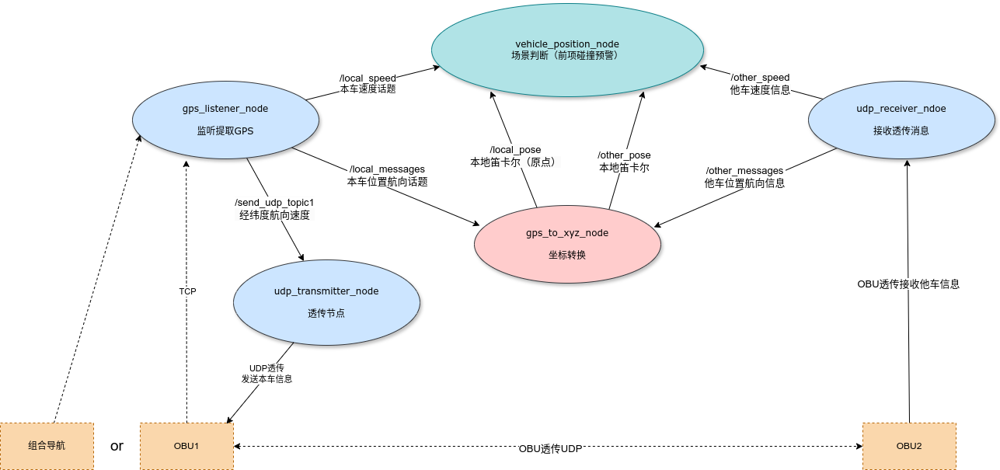

## gps_to_xyz基础功能包功能：
1. gps_listener_node节点，监听gps消息，并且提取有用信息，发布local_messages和local_speed话题和 send_udp_topic1 话题
2. gps_to_xyz_node节点，订阅local_messages和other_messages话题，并将信息转换为xyz坐标系，发布local_pose话题和other_pose话题
3. udp_receiver_node节点，接收透传的信息，发布other_speed话题
4. udp_transmitter_node节点，只进行透传

  
